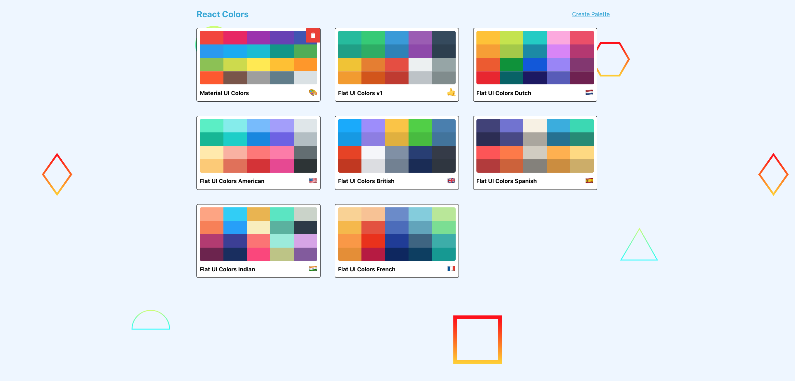
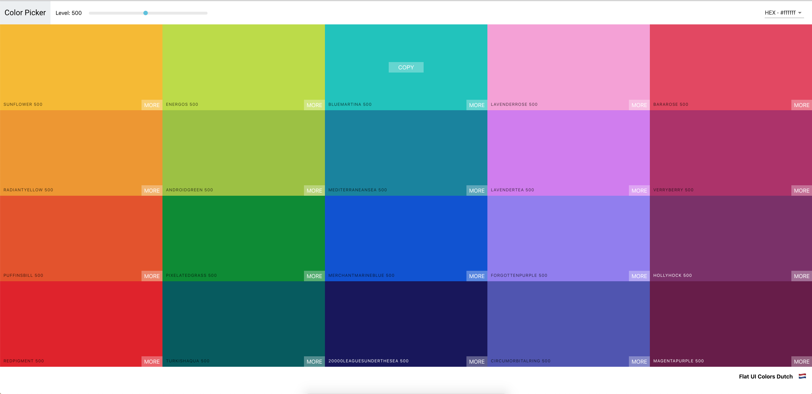
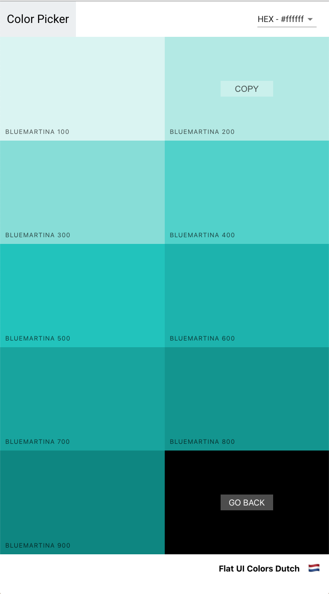
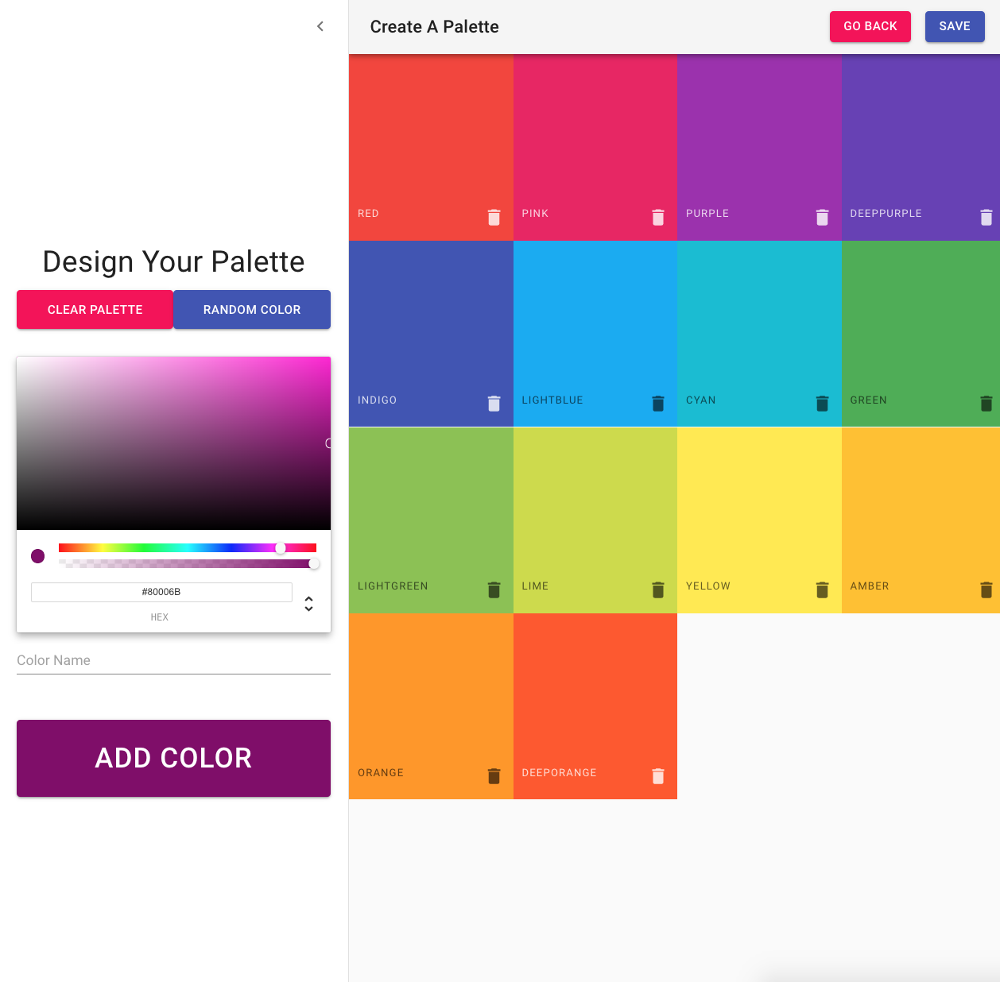

# Color Picker

## Main Page

<strong>Features in main page </strong>  

See all the available pallets  
Delete palettes  
Create a new palette  

## Palette

<strong>Features in individual palette </strong>  

See all colors in palette  
Copying color to clipboard by clicking color  
Change luminosity of all colors  
Explore all color variants for a color   
Select between three color formats  

## Individual Color

<strong>Features in individual color </strong>  
See all shades of one color  
Copy color to clipboard  

## Create New Palette

<strong>Features in create palette page</strong>  
Create a new palette  
Rearrange order of colors 
Name color(s)  
Generate random color(s)  
Delete individual color(s) in palette  
Add a color to the palette based on a hex code  

## Dependencies
<ul>
  <li> material-ui</li>
  <li> chroma-js</li>
  <li> emoji-mart </li>
  <li> rc-Slider </li>
  <li> react-Color</li>
  <li> react-copy-to-clipboard</li>
  <li> react-router-dom </li>
  <li> react-transition-group </li>
  <li> react-sortable-hoc </li> 
</ul>

### `npm start`
Runs the app in the development mode. 
Open [http://localhost:3000](http://localhost:3000) to view it in the browser.

## Inspiration
This app was created when I was taking Colt Steele's React class on Udemy.
